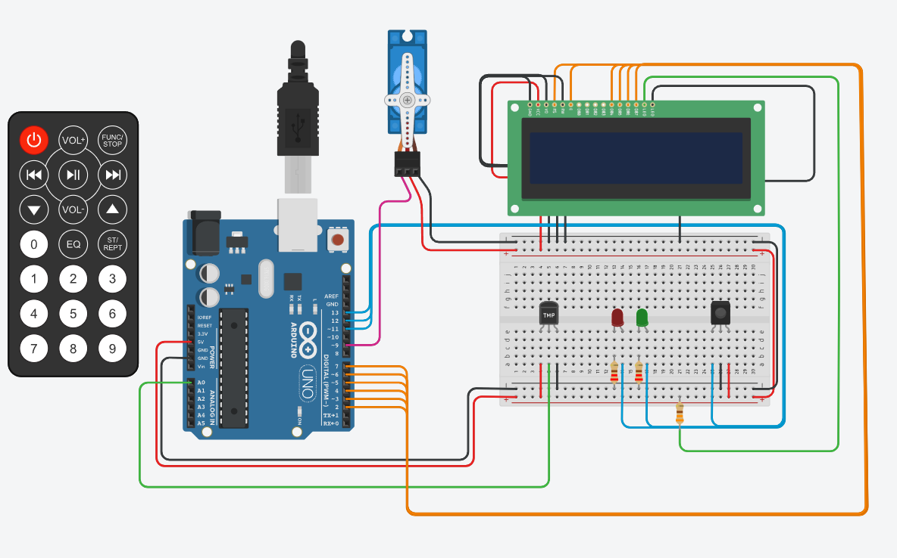
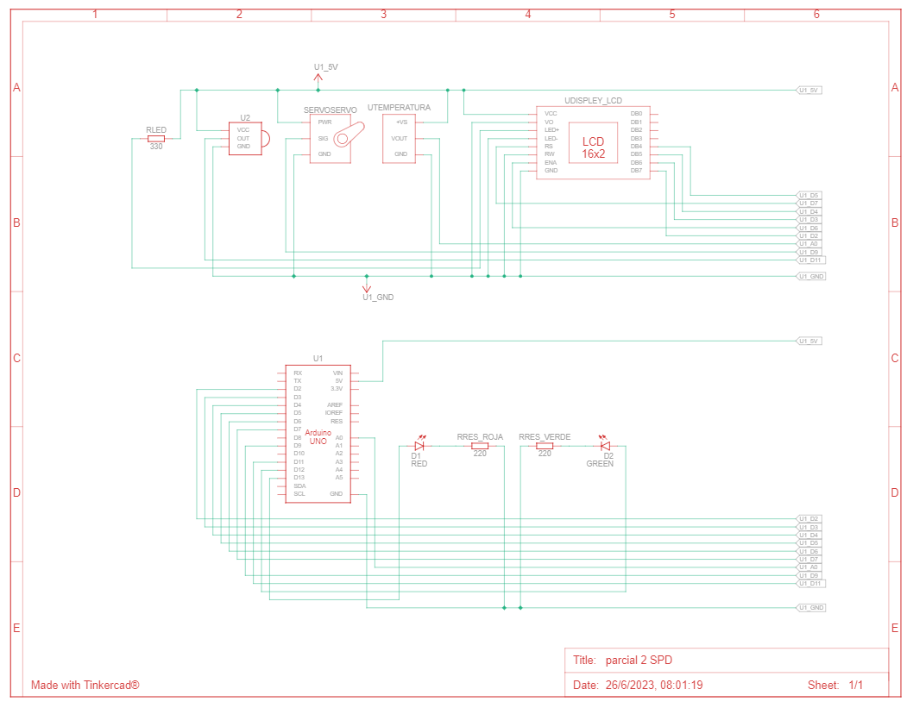
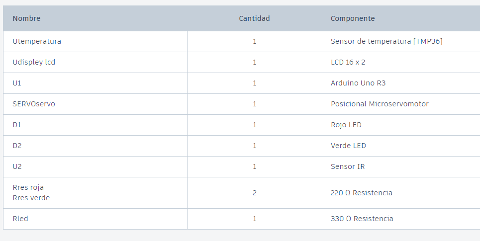

# Documentación 

## Alumno 

- OLIVETO GOÑI AGUSTÍN

---
## Proyecto: Sistema de incendio

---
## Descripción

Siestema anti incendios en el que si la temperatura del lugar supera los 55 C empezara a girar el servo y se prendera la luz roja.

---
## Función principal
La funcion principal es el loop, para comenzar se pregenta si el sistema anti incendios esta encendio, si lo esta puede hacer dos cosas
dependiendo de la temperatura, si hace menos de 55 C se mantendra encendida una luz verde que indica que la temperatura es estable y 
a su vez imprimira en el led la estacion del año en la que se encuentra, ademas d ela temperatura actual. Sin embargo, si la temperatura 
es mayor a 55 C, la luz verde que antes se mantenia encendida se apagara, dando comienzo a una constante luz roja que indica que la temperatura
esta superando los limites normales y se trata de un incendio, por lo que el servo comienza a girar apagando el fuego.

---
~~~ C (lenguaje en el que esta escrito)
void loop()
{
  if (prendido_apagado)
  {
      int lectura_sensor = analogRead(sensor_temperatura);
      float temperatura = (lectura_sensor * 5.0 / 1024.0 - 0.5) * 100.0; //cuenta a grados C°
		
      detectar_temperatura(temperatura);

      if(temperatura > 55)
      {
        lcd.setCursor(0, 0);
        lcd.print("Temperatura: ");
        lcd.print(temperatura);
        delay(20);
        digitalWrite(GREEN, LOW);
        mover_servo();
      }
      else
      {
        detener_servo();
        digitalWrite(GREEN, HIGH);
        lcd.setCursor(0, 0);
        lcd.print("Temperatura: ");
        lcd.print(temperatura);
        delay(200);
      }

        if (IrReceiver.decode()) 
        {
            prender();
        }
  }
  else
  {
    if (IrReceiver.decode()) 
    {
        apagar();
    }
  }
}

~~~

---

## Diagrama:   
---

## Componentes:  
---

---

## Link al proyecto

- [PROYECTO](https://www.tinkercad.com/things/e32t3mfwfO3-super-trug-bruticus/editel?tenant=circuits)

- [GDB](https://onlinegdb.com/gOWsn3J2u)

---

